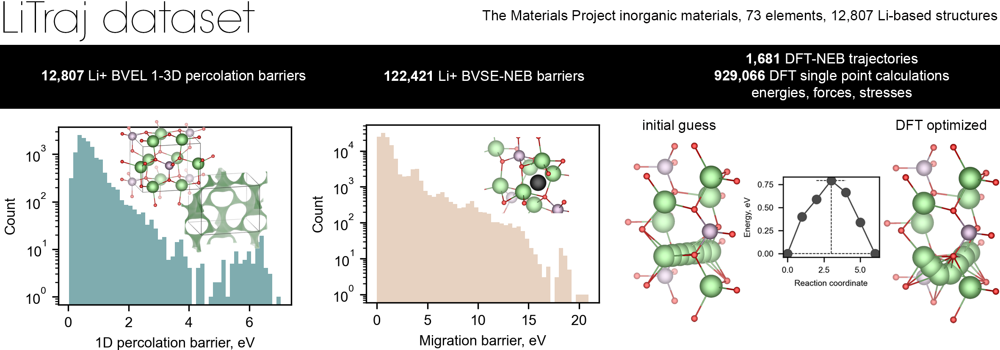
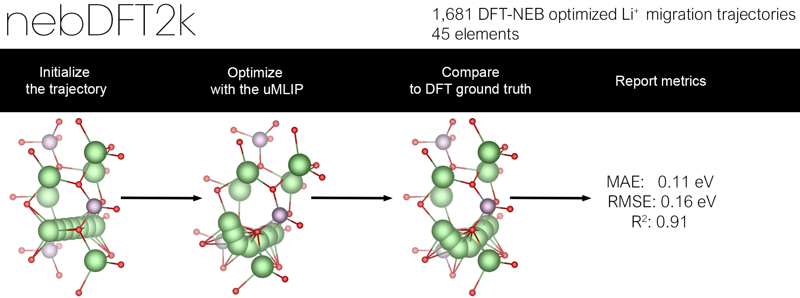

### LiTraj: A Dataset for Benchmarking Machine Learning Models for Predicting Lithium Ion Migration

<p align="left">
<a href="https://github.com/AIRI-Institute/LiTraj/blob/main/LICENSE"></a>


This repository contains links to datasets for benchmarking machine learning models for predicting Li-ion migration, as described in our paper "Benchmarking machine learning models for predicting lithium ion migration", along with Python utilities for handling the datasets.


## Contents
- [About](#about)
- [Source links](#available-datasets-and-source-links)
- [Python tools](#installation)
- [Datasets in detail](#datasets-in-detail)
    - [nebDFT2k](#nebdft2k-dataset)
    - [MPLiTrj](#mplitrj-dataset)
    - [BVEL13k](#bvel13k-dataset)
    - [nebBVSE122k](#nebbvse122k-dataset)
- [Notebooks](#notebooks)
- [Citation](#how-to-cite)


## About

Modern electrochemical devices like Li-ion batteries require materials with fast ion transport. While traditional quantum chemistry methods for predicting ion mobility are computationally intensive, machine learning offers a faster alternative but depends on high-quality data. We introduce the LiTraj dataset, which provides 13,000 percolation barriers, 122,000 migration barriers, and 1,700 migration trajectories — key metrics for evaluating Li-ion mobility in crystals.

The datasets are calculated using density functional theory (DFT) and bond valence site energy (BVSE) methods. For the calculations, we used crystal structures collected from [the Materials Project database](https://next-gen.materialsproject.org/) (see [license](https://creativecommons.org/licenses/by/4.0/)). The data is stored in the extended .xyz format, which can be read by the [Atomistic Simulation Environment](https://wiki.fysik.dtu.dk/ase/) (ASE) Python library.


## Available datasets and source links

We provide training, validation, and test data splits for each dataset. See the [Python Tools](#python-tools) and [Datasets in Detail](#datasets-in-detail) sections to learn how to work with the datasets. 

<table style="font-size: 12px;">
  <tr>
    <th>Dataset</th>
    <th>Theory level</th>
    <th>Specs</th>
    <th>File</th>
    <th>Size</th>
  </tr>
  <tr>
    <td><a href="#nebdft2k-dataset">nebDFT2k</a></td>
    <td>DFT(PBE)</td>
    <td>target: migration barrier, geometry <br/> # of samples: 1,681</td>
    <td><a href="https://bs3u.obs.ru-moscow-1.hc.sbercloud.ru/litraj/nebDFT2k.zip">zip</a> (65 MB)</td>
    <td>0.7 GB</td>
  </tr>
  <tr>
    <td><a href="#nebdft2k-dataset">nebDFT2k_U</a></td>
    <td>DFT(PBE+U)</td>
    <td>target: migration barrier, geometry <br/> # of samples: in progress</td>
    <td>in progress</td>
    <td></td>
  </tr>
  <tr>
    <td><a href="#mplitrj-dataset">MPLiTrj</a></td>
    <td>DFT(PBE)</td>
    <td>target: energy, forces, stress tensor <br/> # of samples: 929,066</td>
    <td><a href="https://bs3u.obs.ru-moscow-1.hc.sbercloud.ru/litraj/MPLiTrj.zip">zip</a> (3.8 GB)</td>
    <td>16 GB</td>
  </tr>
  <tr>
    <td><a href="#mplitrj-dataset">MPLiTrj_subsample</a></td>
    <td>DFT(PBE)</td>
    <td>target: energy, forces, stress tensor <br/> # of samples: 118,024</td>
    <td><a href="https://bs3u.obs.ru-moscow-1.hc.sbercloud.ru/litraj/MPLiTrj_subsample.zip">zip</a> (0.5 GB)</td>
    <td>2.1 GB</td>
  </tr>
  <tr>
    <td><a href="#bvel13k-dataset">BVEL13k</a></td>
    <td>BVSE</td>
    <td>target: 1-3D percolation barrier <br/> # of samples: 12,807</td>
    <td><a href="https://bs3u.obs.ru-moscow-1.hc.sbercloud.ru/litraj/BVEL13k.zip">zip</a> (11 MB)</td>
    <td>35 MB</td>
  </tr>
  <tr>
    <td><a href="#nebbvse122k-dataset">nebBVSE122k</a></td>
    <td>BVSE</td>
    <td>target: migration barrier <br/> # of samples: 122,421</td>
    <td><a href="https://bs3u.obs.ru-moscow-1.hc.sbercloud.ru/litraj/nebBVSE122k.zip">zip</a> (0.2 GB)</td>
    <td>0.9 GB</td>
  </tr>
</table>


## Python tools
### Installation

```python
git clone https://github.com/AIRI-Institute/LiTraj
cd LiTraj
pip install .
```
### Download a specific dataset
```python
from litraj.data import download_dataset
download_dataset('BVEL13k', '.', unzip = True) # save to the current directory and unzip
```

### Read the downloaded dataset 
```python
from litraj.data import load_data
train, val, text, index = load_data('BVEL13k', '.')

for atoms in train:
    mp_id =  atoms.info['material_id']
    e1d = atoms.info['E_1D']
    e2d = atoms.info['E_2D']
    e3d = atoms.info['E_3D']
    # do stuff
    pass
```

For more details see [Datasets basics](notebooks/datasets.ipynb) in the [notebooks](#notebooks)

## Datasets in detail
### nebDFT2k dataset



The nebDFT2k dataset includes Li-ion migration trajectories and corresponding **migration barriers** for 1,681 vacancy hops between initial and final equilibrium sites. The trajectories are optimized using the climbing image nudged elastic band (NEB) method with DFT for force and energy calculations. Initial trajectories were generated via linear interpolation between start and end positions, followed by preconditioning using the BVSE-NEB method from the [ions](https://github.com/dembart/ions) library.


For benchmarking universal machine learning interatomic potentials (uMLIPs), the BVSE-NEB optimized initial trajectories serve as the starting point for uMLIP-NEB optimization. The resulting trajectories are compared to the DFT ground truth. See an [example](notebooks/nebDFT2k_benchmark_MACE_MP_small.ipynb) to learn how to benchmark the pre-trained [MACE_MP](https://github.com/ACEsuit/mace-mp) model.


As an input for graph neural network (GNN) models for structure-to-property prediction of Li-ion migration barriers, we use the supercells with a centroid, marked as 'X' chemical element, added between the starting and final positions of the migrating ion. 


**Structure of the nebDFT2k dataset**

    nebDFT2k/
    ├── nebDFT2k_index.csv              # Table with material_id, edge_id, chemsys, _split, .., columns
    ├── edge-id1_init.xyz               # Initial (BVSE-NEB optimized) trajectory file, edge_id1 = mp-id1_source_target_offsetx_offsety_offsetz
    ├── edge-id1_relaxed.xyz            # Final (DFT-NEB optimized) trajectory file 
    ├── ...
    └── nebDFT2k_centroids.xyz          # File with centroid supercells

**Usage example**

```python
from litraj.data import download_dataset, load_data

# download the dataset to the selected folder
download_dataset('nebDFT2k', 'path/to/save/data') 

# read the dataset from the folder
data = load_data('nebDFT2k', 'path/to/save/data') 

data_train = data[data._split == 'train']
for atoms in data_train.centroid:
    edge_id = atoms.info['edge_id']
    mp_id = atoms.info['material_id']
    em = atoms.info['em']
    # do stuff


for traj_init, traj_relaxed in zip(data.trajectory_init, data.trajectory_relaxed):
    # do stuff
    pass

```


### MPLiTrj dataset

The MPLiTrj dataset contains 929,066 configurations with calculated energies, forces and stress tensors obtained during the DFT-NEB optimization of 2,698 Li-ion migration pathways. Its subsample comprises 118,024 configurations. Each dataset has three .xyz files corresponding to the training, validation, and test data splits.

**Structure of the MPLiTrj dataset**

    MPLiTraj/
    ├── MPLiTrj_train.xyz               # Training file
    ├── MPLiTrj_val.xyz                 # Validation file
    └── MPLiTrj_test.xyz                # Test file 

**Usage example**

```python
from litraj.data import download_dataset, load_data

# download the dataset to the selected folder
download_dataset('MPLiTrj_subsample', 'path/to/save/data') 

train, val, test = load_data('MPLiTrj_subsample', 'path/to/save/data') 

structures, energies, forces, stresses = [], [], [], []
for atoms in train:
    structures.append(atoms)
    energies.append(atoms.calc.get_potential_energy())
    forces.append(atoms.calc.get_forces().tolist())
    stresses.append(atoms.calc.get_stress().tolist())
```

### BVEL13k dataset


The BVEL13k dataset contains Li-ion 1-3D percolation barriers calculated for 12,807 Li-containing ionic crystal structures. The percolation barriers are calculated using BVEL method as implemented in the [BVlain](https://github.com/dembart/BVlain) python package. There are 73 chemical elements (species), each structure contains at most 160 atoms and has a unit cell volume smaller than 1500 Å<sup>3</sup>. 


**Structure of the BVEL13k dataset**

    BVEL13k/
    ├── BVEL13k_index.csv                # Table with material_id, chemsys, _split, E_1D, E_2D, E_3D columns
    ├── BVEL13k_train.xyz                # Training file 
    ├── BVEL13k_val.xyz                  # Validation file 
    └── BVEL13k_test.xyz                 # Test file 

**Usage example**

```python
from litraj.data import download_dataset, load_data

# download the dataset to the selected folder
download_dataset('BVEL13k', 'path/to/save/data') 

# get train, val, test split of the dataset and the index dataframe
atoms_list_train, atoms_list_val, atoms_list_test, index = load_data('BVEL13k', 'path/to/save/data') 

# the data is stored in the Ase's Atoms object
for atoms in atoms_list_train: 

    mp_id = atoms.info['material_id']
    e1d = atoms.info['E_1D']
    e2d = atoms.info['E_2D']
    e3d = atoms.info['E_3D']
    # do stuff
```

### nebBVSE122k dataset

The nebBVSE122k dataset contains Li-ion migration barriers calculated for 122,421 Li-ion vacancy hops from its starting to final equilibrium positions. The migration barriers are calculated using the NEB method employing BVSE approach as implemented in the [ions](https://github.com/dembart/ions) python package. 

As an input for GNN models for structure-to-property prediction, we use the supercells with a centroid, marked as 'X' chemical element, added between the starting and final positions of the migrating ion. 

**Structure of the nebBVSE122k dataset**

    nebBVSE122k/
    ├── nebBVSE122k_index.csv            # Table with material_id, chemsys, _split, em columns
    ├── nebBVSE122k_train.xyz            # Training file 
    ├── nebBVSE122k_val.xyz              # Validation file 
    └── nebBVSE122k_test.xyz             # Test file 


**Usage example**

```python
from litraj.data import download_dataset, load_data

# download the dataset to the selected folder
download_dataset('nebBVSE122k', 'path/to/save/data') 

# get train, val, test split of the dataset and the index dataframe
atoms_list_train, atoms_list_val, atoms_list_test, index = load_data('nebBVSE122k', 'path/to/save/data')

for atoms_with_centroid in atoms_list_train:
    edge_id = atoms_with_centroid.info['edge_id']   # mp-id_source_target_offsetx_offsety_offsetz
    mp_id = atoms_with_centroid.info['material_id']
    em = atoms_with_centroid.info['em']
    centroid_index = np.argwhere(atoms_with_centroid.symbols =='X')
    # do stuff
```

### Notebooks

- [Datasets basics](notebooks/datasets.ipynb)
- [Benchmarking uMLIPs on nebDFT2k](notebooks/nebDFT2k_benchmark_MACE_MP_small.ipynb)
- [M3GNet training on centroids from nebDFT2k](notebooks/m3gnet_nebDFT2k_centroids.ipynb)
- [Allegro training on BVEL13k](notebooks/allegro_BVEL13k.ipynb)
- [BVEL calculations](notebooks/bvel.ipynb)
- [BVSE-NEB calculations](notebooks/bvse_neb.ipynb)
- [Featurizers](notebooks/featurizers.ipynb)


### How to cite
If you use the LiTraj dataset, please, consider citing our paper 
```
@article{none,
      title={none}, 
      author={none},
      year={2025},
      eprint={none},
      archivePrefix={none},
      primaryClass={none},
      url={none}, 
}
```
